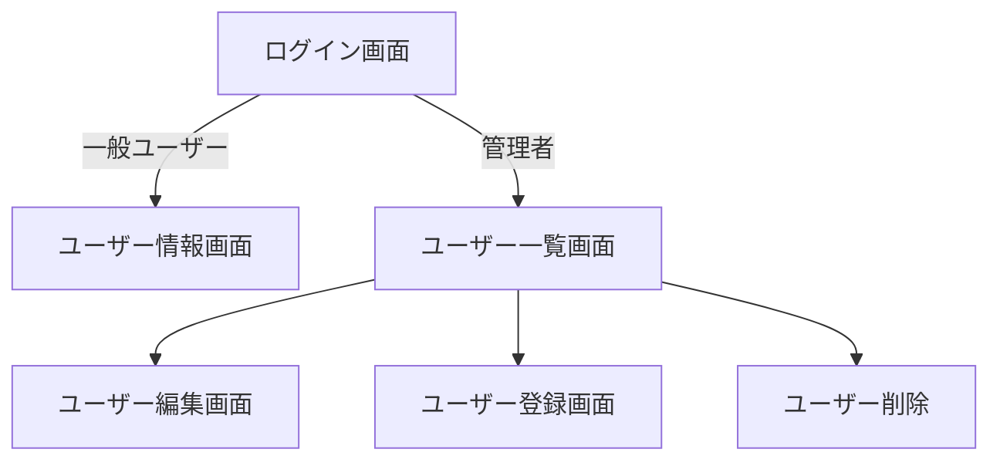

# 要件定義書

## 1. システム概要
本システムはユーザー認証を行い、ログインしたユーザーごとにデータの管理を行うことができる**Webアプリケーション**である。

## 2. システムの目的
一般ユーザーと管理者で利用できる機能を分け、
安全なユーザー管理を実現することを目的とする。
## 3. 利用者
|利用者|説明|
|:---|:---:|
|一般ユーザー|システムを利用するユーザー|
|管理者|ユーザーの一覧と管理|

## 4. システム構成（概要）
* 認証機能
* ユーザー情報管理機能
* 一覧表示機能

## 5. 機能要件

### 5.1 機能一覧
|No|機能名|概要|
|---|-------|------|
|1|ログイン|ユーザー認証を行う|
|2|ログアウト|ログアウトする|
|3|一覧表示|登録済みデータを表示する|
|4|ユーザー管理|ユーザーの登録・編集・削除|

### 5.2 各機能の要件

### ログイン

#### 入力
- メールアドレス
- パスワード

#### 処理
- 一般ユーザーが認証成功時は自身のユーザー情報が表示されるページに遷移
- 管理者が認証成功時は一覧ページに遷移
- 認証失敗時はエラーメッセージを表示し、画面遷移は行わない

#### 出力
- 管理者ユーザの場合は一覧画面を表示する
- 一般ユーザーの場合はユーザー情報ページに遷移

### ログアウト

#### 入力
- ボタンクリック
#### 処理
- ボタンがクリックされるとログイン画面に遷移
#### 出力
- ユーザー認証画面を表示する

### 一覧表示

#### 入力
- 一覧画面を表示する操作
#### 処理
- クリックが成功すると、そのユーザーの詳細画面に遷移
#### 出力
- 詳細画面に遷移

### ユーザー管理

#### 入力
- ユーザー情報を入力する
- 登録内容を変更する
- ユーザー削除を実行する
#### 処理
- **登録ボタン**クリック後、ユーザー登録画面に遷移し、必要事項を記入。
- **編集ボタン**クリック後、編集画面に遷移し、変更を施したら上書きを行う。
- **削除ボタン**クリック後、ユーザー削除の後ログイン画面に遷移
#### 出力
- **登録ボタン**ユーザー登録画面に遷移
- **編集ボタン**編集画面に遷移
- **削除ボタン**ログイン画面に遷移

## 6. 非機能要件

### 性能

- 一般的な操作においてストレスなく利用できること

### セキュリティ

- ログイン認証を行うこと
- 他ユーザーのデータを閲覧できないこと

### 可用性

- ブラウザから利用できること

## 7. 業務ルール

- ユーザーは自身の情報のみを閲覧できる
- 他ユーザーの情報の編集・削除はできない

## 8. 画面一覧
|画面ID|画面名|
|-------|-------|
|SCR001|ログイン|
|SCR002|ユーザー登録|
|SCR003|一覧|
|SCR004|編集|

## 9.画面遷移

## 10. データ要件

### ユーザー
- 名前
- メールアドレス
- パスワード

## 11. 制約事項

- ログインしていない場合は利用できない
- ブラウザから利用する
- インターネット接続が必要

