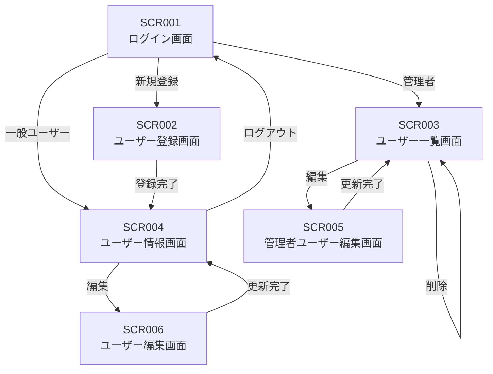
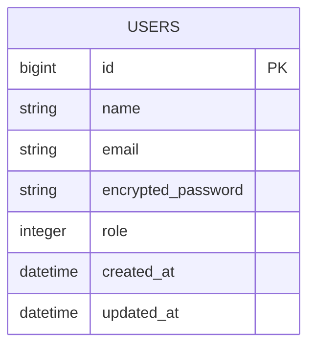

# 基本設計書

---

# 1. システム概要

## 1.1 システム概要

本システムは、ユーザー認証を行い、ログインした利用者の権限に応じてユーザー情報の閲覧・管理を行うWebアプリケーションである。

一般ユーザーは自身の情報を閲覧し、管理者はユーザーの一覧表示・編集・削除を行う。

---

# 2. 画面設計書

## 2.1 画面一覧

|画面ID|画面名|利用者|概要|
|:---|:---|:---|:---|
|SCR001|ログイン画面|一般ユーザー・管理者|ログインを行う|
|SCR002|ユーザー登録画面|一般ユーザー|新規ユーザーを登録する|
|SCR003|ユーザー一覧画面|管理者|登録済みユーザーを一覧表示する|
|SCR004|ユーザー情報画面|一般ユーザー|自身の情報を表示する|
|SCR005|ユーザー編集画面|管理者|ユーザー情報を編集する|

---

## 2.2 画面遷移図

---

## 2.3 ログイン画面

### 概要

利用者認証を行う画面。

### 入力項目

|項目名|必須|説明|
|:---|:---:|:---|
|メールアドレス|○|ログインID|
|パスワード|○|認証用パスワード|

### ボタン

|ボタン|処理|
|:---|:---|
|ログイン|認証を行う|

---

## 2.4 ユーザー情報画面

### 表示項目

|項目|説明|
|:---|:---|
|名前|ユーザー名|
|メールアドレス|ログインユーザーのメールアドレス|

### ボタン

|ボタン|処理|
|:---|:---|
|ログアウト|ログイン画面へ戻る|

---

## 2.5 ユーザー一覧画面

### 表示項目

|項目|説明|
|:---|:---|
|名前|ユーザー名|
|メールアドレス|メールアドレス|
|権限|一般ユーザー・管理者|
|作成日時|登録日時|

### ボタン

|ボタン|処理|
|:---|:---|
|編集|編集画面へ遷移|
|削除|対象ユーザーを削除|

---

## 2.6 ユーザー新規登録

### 表示項目
|項目|説明|
|:---|:---|
|名前|ユーザー名|
|メールアドレス|ログインID|
|パスワード|ログイン時の認証用パスワード|

### ボタン
|ボタン|処理|
|:---|:---|
|新規登録|ユーザー情報画面へ遷移|

# 3. 機能設計

## 3.1 ログイン機能

### 概要

メールアドレスとパスワードで利用者認証を行う。

### 入力

- メールアドレス
- パスワード

### 処理

- 入力チェック
- 認証処理
- 権限判定
- 画面遷移

### 出力

- 一般ユーザー：ユーザー情報画面
- 管理者：ユーザー一覧画面
- 認証失敗：エラーメッセージ

---

## 3.2 ログアウト機能

### 概要

ログイン状態を解除する。

---

## 3.3 ユーザー一覧表示機能

### 概要

管理者が登録済みユーザー一覧を閲覧する。

---

## 3.4 ユーザー登録機能

### 概要

新規ユーザーが登録する。

---

## 3.5 編集機能

### 概要

## ユーザー情報編集機能
一般ユーザーが自身の情報を編集する。

## 管理者ユーザー編集機能
管理者が登録済みユーザー情報を編集する。

---

## 3.6 ユーザー削除機能

### 概要

管理者が登録済みユーザーを削除する。

---

# 4. 入出力定義

## 入力定義

|画面|入力項目|必須|
|:---|:---|:---:|
|ログイン|メールアドレス|○|
|ログイン|パスワード|○|
|ユーザー登録|名前|○|
|ユーザー登録|メールアドレス|○|
|ユーザー登録|パスワード|○|

---

## 出力定義

|画面|出力項目|
|:---|:---|
|ユーザー情報画面|名前・メールアドレス|
|ユーザー一覧画面|名前・メールアドレス・権限・作成日時|

---

# 5. テーブル定義

## users

|カラム名|型|NULL|キー|説明|
|:---|:---|:---:|:---:|:---|
|id|bigint|×|PK|ユーザーID|
|name|string|×||ユーザー名|
|email|string|×|UNIQUE|メールアドレス|
|encrypted_password|string|×||パスワード|
|role|integer|×||権限 (0: 一般ユーザー、1:管理者)|
|created_at|datetime|×||作成日時|
|updated_at|datetime|×||更新日時|

---

# 6. ER図

---

# 7. 認証方式

## 認証方法

- メールアドレス
- パスワード認証

## 権限制御

|機能|一般ユーザー|管理者|
|:---|:---:|:---:|
|ログイン|○|○|
|ログアウト|○|○|
|自身の情報閲覧|○|×|
|ユーザー一覧|×|○|
|ユーザー登録|○|×|
|自身の情報編集|○|×|
|他ユーザー編集|×|○|
|ユーザー削除|×|○|

---

# 8. パスワード方針

- パスワードはハッシュ化して保存する
- 平文では保存しない
- パスワードは8文字以上とする
- ログイン認証時のみ照合する

---

# 9. バリデーション設計

|項目|チェック内容|
|:---|:---|
|名前|必須|
|メールアドレス|必須・形式・重複不可|
|パスワード|必須・8文字以上|

---

# 10. エラーメッセージ

|発生条件|メッセージ|
|:---|:---|
|ログイン失敗|メールアドレスまたはパスワードが正しくありません|
|必須項目未入力|必須項目が未入力のままです|
|メールアドレス重複|既に登録されています|
|権限なし|権限がありません|

---

# 11. 制約事項

- 未ログインユーザーはログイン画面以外へアクセスできない
- 一般ユーザーは自身の情報のみ閲覧できる
- 管理者のみユーザー管理機能を利用できる
- Webブラウザから利用する
- インターネット接続が必要

# 12.　今回実装しない機能

- 一般ユーザー自身による退会機能