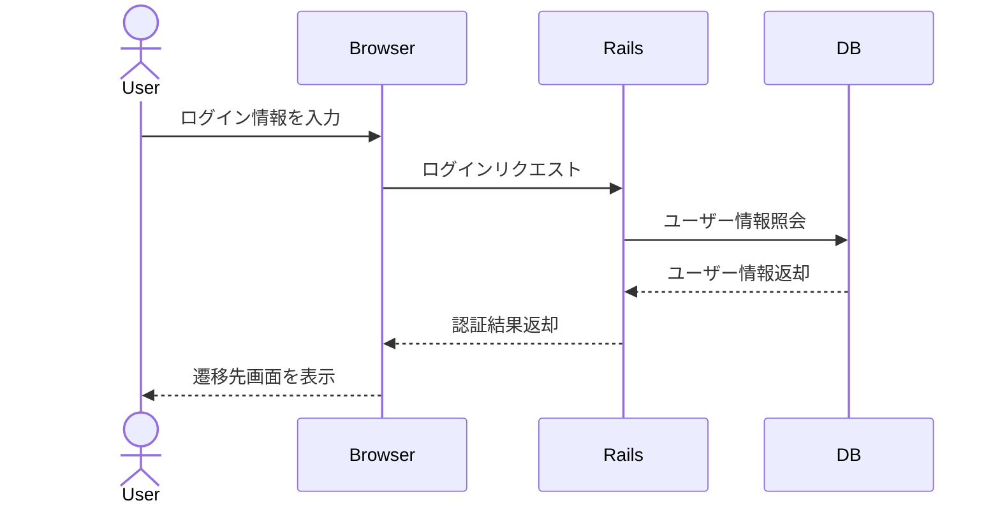

# 詳細設計書

---

# **1. システム概要**

## 1.1 対象システム

> 詳細設計の対象となるシステム名・概要を記載する。

## 1.2 対象範囲

> 今回の詳細設計で扱う機能範囲を記載する。  
> 例：ログイン、ログアウト、ユーザー登録、ユーザー情報表示、ユーザー一覧、編集、削除

---

# **2. 使用技術**

|項目|内容|
|:--|:--|
|開発言語|Ruby on Rails|
|データベース|PostgreSQL|
|開発環境|Docker for Desktop|
|os|Ubuntu|

---

# **3. ルーティング設計**

|HTTPメソッド|URL|Controller|Action|概要|
|:---|:---|:---|:---|:---|
|GET|/users/sign_in|Devise|new|ログイン画面表示|
|POST|/users/sion_in|Devise|create|ログインを実行|
|DELETE|/users/sign_out|Devise|destroy|ログアウトを実行|
|GET|/users/sign_up|Devise|new|新規登録画面を表示|
|POST|/users|Devise|create|ユーザー登録を実行|
|GET|/users|UsersController|index|一覧画面を表示|
|GET|/users/:id|UsersController|show|ユーザー情報を表示|
|GET|/users/:id/edit|UsersController|edit|編集画面を表示|
|PATCH|/users/:id|UsersController|update|更新を実行|
|DELETE|/users/:id|UsersController|destroy|削除を実行|

---

# **4. コントローラ設計**

## 4.1 UsersController
|処理|概要|
|:---|:---|
|index|一覧表示|
|show|自身の情報を表示|
|edit|ユーザー情報の編集フォームを表示|
|update|DBの情報を更新|
|destroy|情報を削除|

## 4.2 Devise::SessionsController
|処理|概要|
|:---|:---|
|new|ログイン画面を表示|
|create|ログイン処理を実行|
|destroy|ログアウト処理を実行|

## 4.3 Devise::RegistrationsController
|処理|概要|
|:---|:---|
|new|ユーザー登録画面を表示|
|create|ユーザーを登録|

---

# 5. **モデル設計**

## 5.1 モデル一覧

|モデル名|対応テーブル|役割|
|:--|:--|:--|
|Users|users|認証情報、ユーザー情報、権限情報を管理|

## 5.2 Userモデル

|項目|内容|
|:--|:--|
|モデル名|Users|
|対応テーブル|users|
|主な役割|認証情報、ユーザー情報管理、権限判定|
|認証方式|Devise|
|権限管理|roleカラムで管理|

## 5.3 関連設計

今回は存在するモデルがUsersだけなので関連設計はない

## 5.4 enum設計

### role

|値|名称|説明|
|:---:|:---|:---|
|0|general|一般ユーザー|
|1|admin|管理者|

---

# 6. DB詳細設計

> テーブルごとのカラム、型、NULL可否、キー、制約、初期値を記載する。

## 6.1 usersテーブル

## users

|カラム|型|NULL|備考|
|:---|:---|:---:|:---|
|id|bigint|×|PK|
|name|string|×||
|email|string|×|UNIQUE|
|encrypted_password|string|×||
|role|integer|×|0:一般 1:管理者|
|created_at|datetime|×||
|updated_at|datetime|×||

---

# 7. バリデーション設計

## 7.1 ユーザー登録

|項目|必須|文字数|その他|エラー時の動作|
|:--|:--|:--|:--|:--|
|名前|○|50文字以内|-|メッセージ表示 「条件を満たしていません」|
|メールアドレス|○|254文字以内|メールアドレスの重複× メールアドレス形式|メッセージ表示 「条件を満たしていません」
|パスワード|○|8文字以上|-|メッセージ表示 「条件を満たしていません」

## 7.2 ログイン画面

|項目|必須|その他|エラー時の動作|
|:--|:--|:--|:--|
|メールアドレス|○|メールアドレス形式|メッセージ表示 「メールアドレスが間違っています」
|パスワード|○|-|メッセージ表示 「パスワードが間違っています」

---

# 8. 認可・権限制御設計

> 一般ユーザーと管理者で利用できる機能を整理する。

|機能|一般ユーザー|管理者|
|:---|:---:|:---:|
|ログイン|○|○|
|新規登録|○|×|
|ユーザー情報編集|

---

# 9. 処理フロー

> 機能ごとの処理の流れを順番に記載する。  
> 実装前に「何をどの順番で処理するか」を整理する。

## 9.1 ログイン処理フロー

1. 
2. 
3. 

## 9.2 ユーザー登録処理フロー

1. 
2. 
3. 

## 9.3 ユーザー一覧表示処理フロー

1. 
2. 
3. 

## 9.4 ユーザー編集処理フロー

1. 
2. 
3. 

## 9.5 ユーザー削除処理フロー

1. 
2. 
3. 

---

# 10. シーケンス図

> 利用者、ブラウザ、Rails、DBのやり取りをMermaidで記載する。  
> 特にログイン、登録、編集、削除などの主要処理を書く。

## 10.1 ログイン

